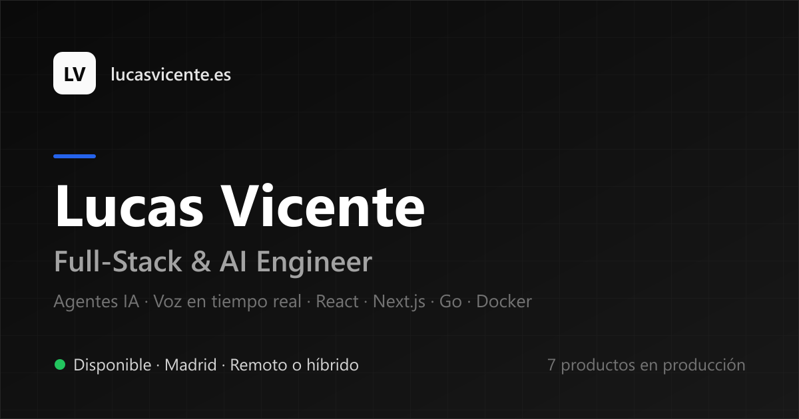

<div align="center">



# Portfolio · Lucas Vicente

**Casos reales con métricas, decisiones técnicas explícitas y contacto sin fricción.**
Pensado para que un recruiter técnico entienda en 30 segundos qué construyo y cómo decido.

[**lucasvicente.es**](https://lucasvicente.es) · bilingüe ES/EN · tema claro/oscuro


</div>

---

## Qué tiene de particular

Más allá de ser una web bonita, estas son las decisiones que merecen mención:

- **Estructura Contexto → Decisión → Resultado** en cada caso, con métricas verificables. No es una lista de tecnologías: explica *por qué* se eligió cada cosa.
- **Bilingüe real** ES/EN desde un único objeto `copy`, con paridad de claves garantizada (nada de traducciones a medias).
- **Tema claro por defecto**, con modo oscuro opcional persistido en `localStorage` y script anti-FOUC para que no parpadee al cargar.
- **Diagrama de arquitectura anonimizado** para el caso bajo NDA: se comparte la forma del sistema sin exponer datos del cliente.
- **Formulario de contacto serverless** con Cloudflare Turnstile, validación en servidor y cabeceras de seguridad (CSP incluida).
- **Scroll-spy** con `IntersectionObserver` y navegación accesible por teclado.
- **Imágenes generadas por script** (Open Graph y diagrama), versionadas y reproducibles.

## Stack

| Capa | Tecnología |
|---|---|
| Frontend | React 19 · TypeScript 5 · Vite 7 |
| UI | Tailwind CSS · [shadcn/ui](https://ui.shadcn.com/) (Radix) · Lucide |
| Backend | Cloudflare Workers (`/api/contact` + Turnstile + Resend) |
| CI/CD | GitHub Actions → Cloudflare Workers |

## Estructura

```
src/
  App.tsx                 Layout, casos y copy bilingüe (ES/EN) en un solo lugar
  index.css               Tokens de tema (claro y oscuro)
  components/ui/          Primitivos shadcn/ui
worker/
  index.ts                Endpoint /api/contact: Turnstile, rate limit, cabeceras
scripts/
  generate-og.mjs         Genera public/og-image.png
  generate-arch-diagram.mjs   Genera el diagrama de arquitectura (anonimizado)
public/
  cv-lucas-vicente.pdf    CV descargable (exportado desde cv-lucas-vicente.html)
  images/                 Capturas y diagramas de los casos
cv-lucas-vicente.html     Fuente del CV (ver "Regenerar el CV en PDF")
```

## Desarrollo

Requiere Node 22 (hay `.nvmrc`).

```bash
npm install
npm run dev          # http://localhost:5173
```

## Scripts

| Comando | Qué hace |
|---|---|
| `npm run dev` | Servidor de desarrollo |
| `npm run build` | `tsc -b` + build de producción |
| `npm run preview` | Preview del build |
| `npm run lint` | ESLint |
| `npm run cf:dev` | Build + `wrangler dev` (Worker en local) |
| `npm run deploy:cf` | Build + `wrangler deploy` (producción) |
| `node scripts/generate-og.mjs` | Regenera la imagen Open Graph |
| `node scripts/generate-arch-diagram.mjs` | Regenera el diagrama de arquitectura |

### Regenerar el CV en PDF

El CV se edita en `cv-lucas-vicente.html` y se exporta con Chrome headless (sin encabezados
ni pies de página, que es lo que añade el diálogo de impresión del navegador):

```bash
chrome --headless=new --disable-gpu --no-pdf-header-footer \n  --print-to-pdf="public/cv-lucas-vicente.pdf" \n  "file:///ruta/absoluta/a/cv-lucas-vicente.html"
```

## Seguridad

El Worker aplica en todas las respuestas: `Content-Security-Policy`, `Strict-Transport-Security`,
`X-Content-Type-Options`, `X-Frame-Options`, `Referrer-Policy` y `Permissions-Policy`.

El endpoint de contacto además: verifica **Turnstile en servidor**, comprueba el `Origin`,
valida y acota los campos, sanea el asunto y **nunca devuelve detalles internos** en los errores
(van a logs). El rate limit en memoria es *best-effort* — la barrera real son Turnstile y las
reglas de Rate Limiting de Cloudflare.

Los secretos (`RESEND_API_KEY`, `TURNSTILE_SECRET_KEY`) se gestionan con `wrangler secret put`
y **nunca** están en el repositorio.

## Contacto

- **Email**: [contacto@lucasvicente.es](mailto:contacto@lucasvicente.es)
- **LinkedIn**: [Lucas Esteban Vicente Cerri](https://www.linkedin.com/in/lucas-esteban-vicente-cerri-3073a8330/)
- **GitHub**: [@lucasvicentec](https://github.com/lucasvicentec)
- **Reservar 30 min**: [Calendly](https://calendly.com/lucasvicentecerri6/30min)

## Licencia

MIT — ver [LICENSE](./LICENSE). El código es libre; los textos, imágenes y casos son contenido personal.
